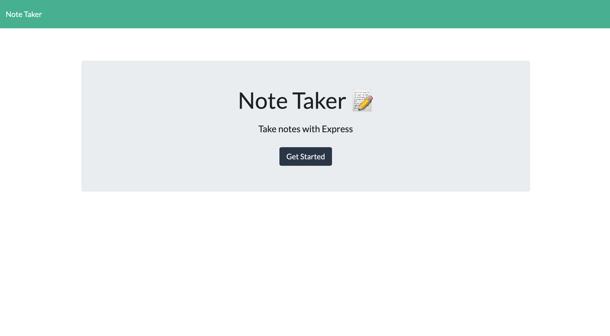
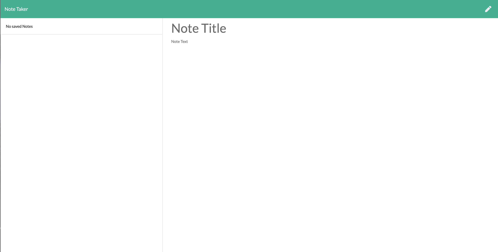
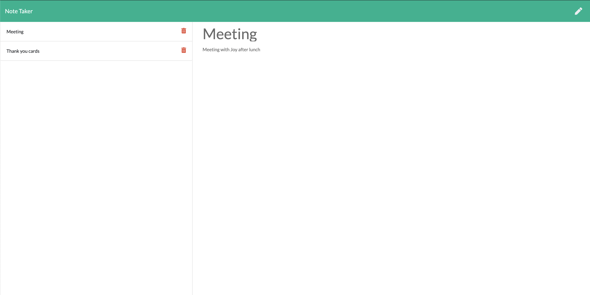
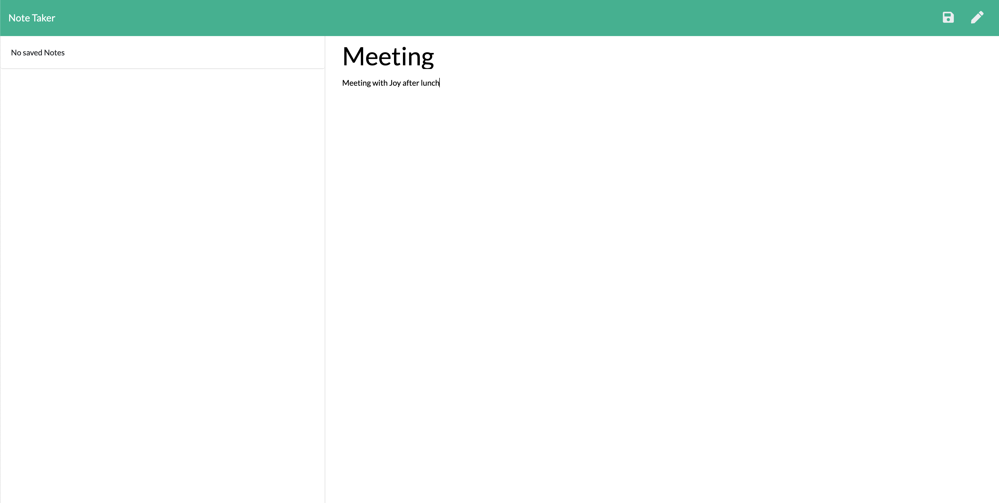

# Note-Taker 

## Table of Content

* [Installation Instructions](#Installation-Instruction)
* [Description](#Description )
* [Usage Information](#Usage-Information)
* [License](#License)
* [Contributing Guildline](#Contributing-Guildline)
* [Tests Instructions](#Tests-Instructions)
* [Questions](#Questions)

## Installation Dependencies
* npm init | npm install express, mysql, uuid

## Description
* This application is used for writing, saving and delete notes. It will use an express backend to save and retrieve note data from a JSON file.

## Usage Information
* For users that need to keep track of a lot of information, it's easy to forget or be unable to recall something important. 
* Being able to take persistent notes allows users to have written information available when needed. 
* With this application the users will be able to write and save notes also delete notes that have written before.

## License

## Contributing Guildeline
* I encourage public contributions.

## Tests Instructions
* After a user click "Get Started" button, the application will present the Note Taker page which the user will be able to create note on Note Title and detail on Note text on the right section of the page. 

 

 

* After the user write the note, the delete icon will appear on the top right conner of the page. Once the user click save icon, the note will appear on the left section with delete icon, the users also be able to view previously saved notes. 

 

* The application allow the users to delete recent and previously saved notes 

 

## Questions

  * Github link : https://github.com/Saipurciful
  * How to reach me with additional questions : <saipurciful@gmail.com>

## Link to the project site. 
* 
